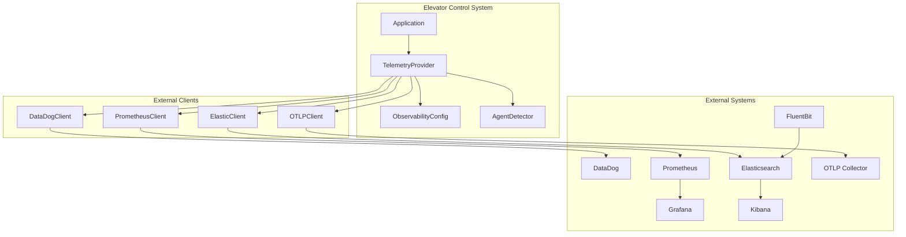

# External Observability Integration Guide

## Overview

This document describes the comprehensive external observability integration system for the elevator control system, designed to support on-premise deployments with various observability platforms and agents.

## 🎯 **Key Features**

### **Dynamic Platform Support**
- **DataDog**: Complete metrics, APM traces, and log forwarding
- **Elasticsearch/ELK**: Structured logging with automatic index rotation
- **Prometheus**: Both pull-based scraping and push gateway support
- **OpenTelemetry (OTLP)**: Industry-standard telemetry protocol

### **Agent Auto-Detection**
- **DataDog Agent**: Automatic detection via environment variables
- **FluentBit/Fluent**: Log forwarding and processing
- **OpenTelemetry Collector**: Unified telemetry collection
- **Filebeat**: Elasticsearch log shipping

### **Flexible Configuration**
- Environment variable-based configuration
- Intelligent defaults based on detected agents
- Support for both pull and push patterns
- Multi-backend simultaneous export

## 🚀 **Quick Start**

### **1. Basic Setup**

```bash
# Enable observability
export OBSERVABILITY_ENABLED=true
export SERVICE_NAME=elevator-control-system
export ENVIRONMENT=production

# Auto-detect agents
export AGENTS_AUTO_DETECT=true
```

### **2. DataDog Integration**

```bash
# Set DataDog API key (triggers auto-detection)
export DD_API_KEY=your_datadog_api_key
export DD_AGENT_HOST=datadog-agent

# The system will automatically:
# - Enable DataDog integration
# - Configure push-based metrics
# - Enable APM tracing
# - Set up structured logging
```

### **3. Elasticsearch + FluentBit**

```bash
# Configure Elasticsearch
export ELASTIC_ENABLED=true
export ELASTIC_HOST=elasticsearch
export ELASTIC_INDEX=elevator-logs

# Configure FluentBit (triggers auto-detection)
export FLUENTD_HOST=fluentbit
export LOGGING_FORMAT=json
export LOGGING_OUTPUT=stdout
```

### **4. OpenTelemetry Collector**

```bash
# Configure OTLP endpoint (triggers auto-detection)
export OTEL_EXPORTER_OTLP_ENDPOINT=http://otel-collector:4317
export OTLP_ENABLED=true
export METRICS_PUSH_ENABLED=true
export TRACING_ENABLED=true
```

## 📊 **Architecture**



## 🔧 **Configuration Reference**

### **Core Settings**
| Variable | Default | Description |
|----------|---------|-------------|
| `OBSERVABILITY_ENABLED` | `true` | Enable/disable observability |
| `SERVICE_NAME` | `elevator-control-system` | Service name for telemetry |
| `ENVIRONMENT` | `development` | Environment identifier |
| `SERVICE_VERSION` | `1.0.0` | Service version |

### **Metrics Configuration**
| Variable | Default | Description |
|----------|---------|-------------|
| `METRICS_ENABLED` | `true` | Enable metrics collection |
| `METRICS_PUSH_ENABLED` | `false` | Enable push-based metrics |
| `METRICS_PULL_ENABLED` | `true` | Enable pull-based metrics |
| `METRICS_PUSH_INTERVAL` | `15s` | Push interval for metrics |
| `METRICS_NAMESPACE` | `elevator` | Metrics namespace |
| `METRICS_CUSTOM_LABELS` | `` | Custom labels (key1=value1,key2=value2) |

### **Logging Configuration**
| Variable | Default | Description |
|----------|---------|-------------|
| `LOGGING_ENABLED` | `true` | Enable logging |
| `LOGGING_LEVEL` | `info` | Log level (debug, info, warn, error) |
| `LOGGING_FORMAT` | `json` | Log format (json, text, console) |
| `LOGGING_OUTPUT` | `stdout` | Output destination |
| `LOGGING_STRUCTURED_EXTRA` | `` | Extra structured fields |

### **Platform-Specific Settings**

#### **DataDog**
| Variable | Default | Description |
|----------|---------|-------------|
| `DATADOG_ENABLED` | `false` | Enable DataDog integration |
| `DATADOG_API_KEY` | `` | DataDog API key |
| `DATADOG_APM_ENABLED` | `false` | Enable APM tracing |
| `DATADOG_LOG_ENABLED` | `false` | Enable log forwarding |

#### **Elasticsearch**
| Variable | Default | Description |
|----------|---------|-------------|
| `ELASTIC_ENABLED` | `false` | Enable Elasticsearch integration |
| `ELASTIC_HOST` | `localhost` | Elasticsearch host |
| `ELASTIC_INDEX` | `elevator-logs` | Log index pattern |
| `ELASTIC_INDEX_ROTATION` | `daily` | Index rotation (daily, weekly, monthly) |

#### **Prometheus**
| Variable | Default | Description |
|----------|---------|-------------|
| `PROMETHEUS_ENABLED` | `true` | Enable Prometheus integration |
| `PROMETHEUS_PUSH_ENABLED` | `false` | Enable push gateway |
| `PROMETHEUS_PUSH_GATEWAY` | `` | Push gateway URL |
| `PROMETHEUS_SCRAPE_PORT` | `8080` | Scrape port |

#### **OTLP**
| Variable | Default | Description |
|----------|---------|-------------|
| `OTLP_ENABLED` | `false` | Enable OTLP integration |
| `OTLP_ENDPOINT` | `http://localhost:4317` | OTLP gRPC endpoint |
| `OTLP_INSECURE` | `true` | Use insecure connection |

## 📝 **Usage Examples**

### **Recording Custom Metrics**

```go
// Initialize telemetry provider
config, _ := observability.LoadObservabilityConfig()
provider, _ := observability.NewTelemetryProvider(config, logger)

// Record metrics (automatically sent to all configured backends)
provider.RecordMetric(ctx, "elevator_efficiency", 0.95, map[string]string{
    "elevator": "Elevator-1",
    "floor":    "5",
})
```

### **Structured Logging**

```go
// Create structured logger
logger := observability.NewStructuredLogger(config.Logging, provider)

// Log with automatic forwarding to external systems
logger.Log("info", "Elevator request processed", map[string]interface{}{
    "elevator_id":     "Elevator-1",
    "floor_from":      3,
    "floor_to":        7,
    "duration_ms":     2500,
    "passenger_count": 2,
})
```

### **Distributed Tracing**

```go
// Create spans for distributed tracing
ctx, span := provider.CreateSpan(ctx, "elevator_request",
    trace.WithAttributes(
        attribute.String("elevator.name", "Elevator-1"),
        attribute.Int("floor.target", 5),
    ),
)
defer span.End()

// Process request...
// Span data automatically sent to configured backends
```

## 🐳 **Docker Deployment**

Use the provided Docker Compose file for a complete observability stack:

```bash
# Set DataDog API key (optional)
export DD_API_KEY=your_datadog_api_key

# Start the complete stack
docker-compose -f observability-stack.docker-compose.yml up -d

# Access services:
# - Elevator API: http://localhost:6660
# - Prometheus: http://localhost:9090
# - Grafana: http://localhost:3000 (admin/admin)
# - Kibana: http://localhost:5601
# - Jaeger: http://localhost:16686
```

## 🔍 **Monitoring Dashboards**

### **Prometheus/Grafana Metrics**
- Elevator request rates and latencies
- System resource utilization
- Circuit breaker status
- Error rates and types

### **Elasticsearch/Kibana Logs**
- Structured log analysis
- Error tracking and alerting
- Performance analysis
- Request flow visualization

### **DataDog Integration**
- Real-time metrics and alerts
- APM trace analysis
- Infrastructure monitoring
- Custom dashboards

### **Jaeger Tracing**
- Distributed trace visualization
- Request flow analysis
- Performance bottleneck identification
- Service dependency mapping

## 🚨 **Best Practices**

### **Production Deployment**
1. **Use appropriate sampling rates** for tracing (0.1-0.01 for high-volume)
2. **Configure retention policies** for logs and metrics
3. **Set up alerting** for critical metrics and errors
4. **Monitor observability overhead** and adjust configurations

### **Security Considerations**
1. **Secure API keys** using environment variables or secrets management
2. **Use TLS** for external connections in production
3. **Limit metric cardinality** to prevent performance issues
4. **Filter sensitive data** from logs and traces

### **Performance Optimization**
1. **Use batching** for high-volume telemetry data
2. **Configure appropriate buffer sizes** for logging
3. **Enable compression** for data transmission
4. **Monitor resource usage** of observability components

## 🔄 **Migration Guide**

### **From Existing Prometheus Setup**
1. Keep existing Prometheus configuration
2. Add new observability configuration
3. Enable multi-backend support gradually
4. Migrate dashboards and alerts

### **Adding DataDog Integration**
1. Set `DD_API_KEY` environment variable
2. Enable auto-detection: `AGENTS_AUTO_DETECT=true`
3. Configure push metrics: `METRICS_PUSH_ENABLED=true`
4. Verify data in DataDog dashboards

### **Elasticsearch Integration**
1. Deploy Elasticsearch and FluentBit
2. Set `FLUENTD_HOST` environment variable
3. Configure structured logging: `LOGGING_FORMAT=json`
4. Verify logs in Kibana

## 📚 **Reference Files**

- **Configuration**: `configs/observability.env.example`
- **Documentation**: `docs/metrics.md`
- **Docker Setup**: `docs/observability-stack.docker-compose.yml`
- **Implementation**: `internal/infra/observability/`

## 🆘 **Troubleshooting**

### **Agent Detection Issues**
- Verify environment variables are set correctly
- Check agent connectivity and health
- Review auto-detection logs
- Manually enable specific integrations if needed

### **Metrics Not Appearing**
- Verify push/pull configuration
- Check network connectivity to external systems
- Review metric names and labels
- Validate authentication credentials

### **Log Forwarding Problems**
- Check log format configuration
- Verify agent configuration and connectivity
- Review log sampling settings
- Validate index patterns and mappings

This comprehensive observability integration provides enterprise-grade monitoring capabilities while maintaining flexibility for various deployment scenarios and organizational preferences. 