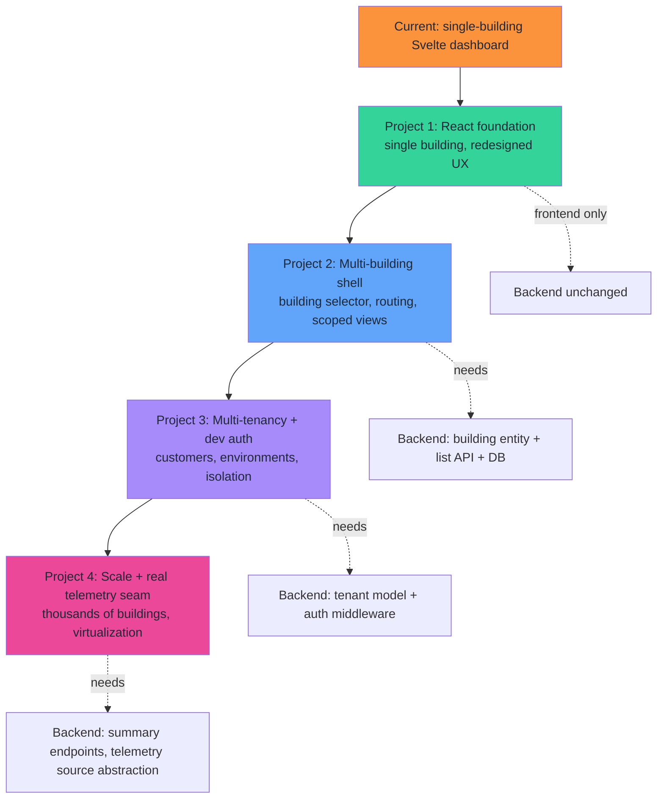
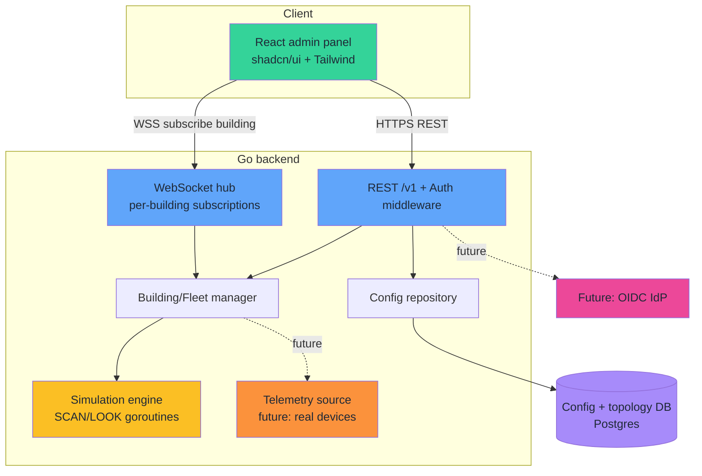
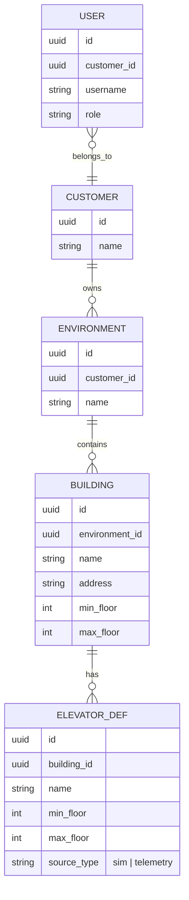
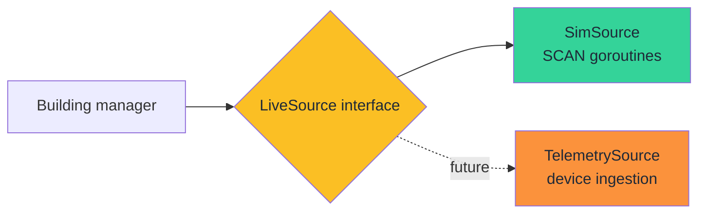
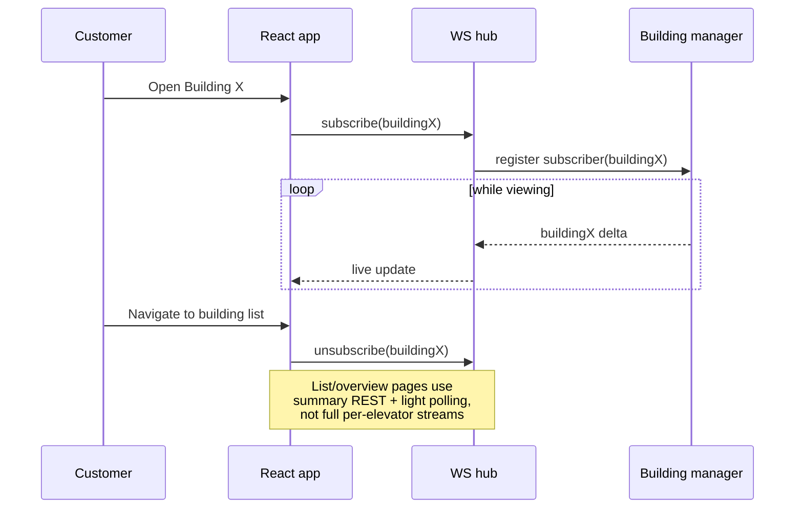
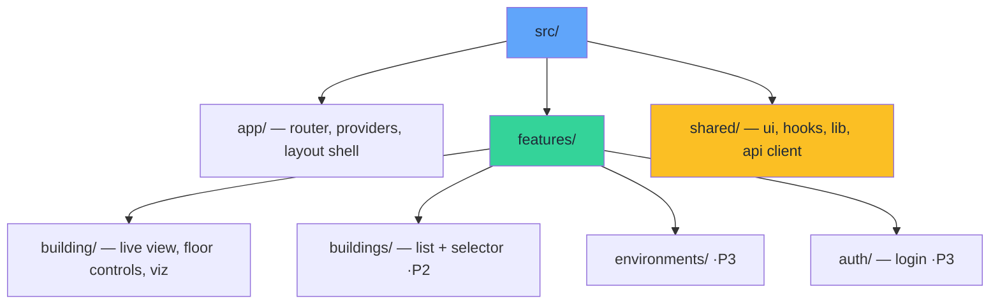

# Elevator SaaS — North-Star Architecture Design

**Date:** 2026-05-30
**Status:** Draft for review
**Scope:** Whole-vision architecture (frontend + backend evolution), decomposed into phased projects.

---

## 1. Vision

Evolve the current single-building elevator simulator into a **multi-tenant SaaS admin panel**. Customers log in and view the live status of their elevators, organized as:

```
Customer → Environment(s) → Building(s) → Elevator(s)
```

Each page shows **one building**; the customer chooses which building to view. The platform must scale to **thousands of buildings** across many customers. Elevators may be **simulated** (today, and for demos) or backed by **real telemetry** (future) — the dashboard treats both identically.

### Guiding decisions (locked)

| Decision | Choice |
|---|---|
| Frontend direction | UX **redesign** on a maintainable React foundation (not a 1:1 port) |
| Product nature | **Both** — simulation is the core today; real-elevator telemetry is a future parallel data source behind the same abstraction |
| Persistence | **Config + topology only** (customers, environments, buildings, elevator defs, users). Live elevator state stays ephemeral/real-time. Telemetry history is a documented future seam. |
| Real-time at scale | **Subscribe per-viewed-building.** Overview/list pages use summaries or polling, not full per-elevator streams. |
| Auth | **Dev-oriented now** — single `admin:admin` login. Tenant model + pluggable auth middleware designed as a seam for a future OIDC/JWT IdP. No paid third party now. |
| UI foundation | **shadcn/ui + Tailwind** (own-the-code components on Radix primitives). |

---

## 2. Decomposition into Projects

This vision is too large for one spec. It decomposes into four sequenced projects. Only **Project 1 is purely frontend**; Projects 2–4 each add backend capability. Each project gets its own detailed spec when it is started.



**Sequencing rationale:** Build the maintainable React base first (no backend risk), then layer structure (buildings), then identity (tenants), then scale. Each step is shippable and de-risks the next.

---

## 3. Target Architecture (end state)

### 3.1 System context



### 3.2 Domain model (config + topology persisted)



**Note:** `ELEVATOR_DEF` is the *durable definition*. Live state (current floor, direction, pending requests, faults) is **not** stored — it is produced by the simulation engine or, later, a telemetry source, and reconstructed when a client subscribes.

### 3.3 The source abstraction (sim vs. real)

A building's live elevator state comes from a `LiveSource` behind one interface. Today only the simulation implementation exists; real telemetry slots in later without touching the manager, WS hub, or frontend.



### 3.4 Real-time at scale



---

## 4. Frontend Architecture (applies from Project 1)

### 4.1 Stack

- **Vite + React 19 + TypeScript** (SPA). Keeps the static GitHub Pages + nginx deploy intact; SSR adds no value for a real-time WS dashboard.
- **shadcn/ui + Tailwind + Radix** for accessible admin components (tables, dialogs, command palette, sidebar, dropdowns).
- **TanStack Query** for REST data (caching, retries, invalidation) — replaces ad-hoc `fetch` + manual store writes.
- **Zustand** (or React context + reducer) for ephemeral live state (the subscribed building's elevators). Lightweight, no boilerplate.
- **React Router** for the customer → environment → building navigation that Projects 2+ need.

### 4.2 Folder structure (grows with the projects)



**Feature-sliced layout:** each feature owns its components, hooks, and types; `shared/` holds cross-cutting UI and the typed API/WS clients. New projects add new feature folders rather than rewriting existing ones.

### 4.3 Data-layer seam

A single typed **API client** and a single **WS subscription hook** (`useBuildingLiveState(buildingId)`). In Project 1, `buildingId` is a constant ("the one building"); in Project 2 it becomes a route param. The component code does not change — only what feeds the id. This is the key seam that lets the single-building UI grow into the multi-building admin panel without a rewrite.

### 4.4 Issues from the current Svelte client we deliberately leave behind

- WS service with **side effects at import time** → replaced by an explicit provider/hook lifecycle tied to the viewed building.
- **Full-store rewrite every 100ms** → deltas + memoized selectors; only changed elevators re-render.
- **Dead API stubs** (`emergencyStop`, `scheduleMaintenance`, etc. throwing "Not implemented") → removed; client exposes only real endpoints.
- **`console.log` debug noise** throughout → structured, level-gated logging off by default.
- Duplicated backend→client transform logic in both `api.ts` and `websocket.ts` → one shared mapper.

---

## 5. Backend Evolution (per project)

| Project | Backend change | Notes |
|---|---|---|
| **P1** | None | Frontend-only. Existing `/v1` REST + `/ws/status` stay as-is. |
| **P2** | Add `building` entity, buildings-list endpoint, scope status by building; introduce Postgres for topology | The current "one anonymous fleet" becomes "building 1's fleet". |
| **P3** | Tenant model (customer/environment), pluggable auth middleware, dev `admin:admin` login, tenant-scoped queries | Seam for OIDC/JWT; no paid IdP yet. |
| **P4** | Summary endpoints for overview pages, per-building WS subscription model, `LiveSource` abstraction (sim vs. telemetry) | Enables thousands of buildings + future real devices. |

The existing clean architecture (**Handlers → Manager → Elevator → Domain**) is preserved; the manager gains a building dimension and the `LiveSource` interface.

---

## 6. Cross-Cutting Optimizations (folded in along the way)

These address known issues in today's codebase and are scheduled into the project where they fit:

- **Frontend re-render efficiency** (P1): delta updates, memoized selectors, virtualized lists ready for P4.
- **Typed end-to-end contract** (P1→P2): generate TS types from the backend OpenAPI (`docs/openapi.yaml`) so client and server can't drift.
- **WS reconnection & backpressure** (P1): explicit lifecycle, exponential backoff already present — keep, but tie to subscription not page load.
- **Observability continuity** (P2+): preserve the existing Prometheus metrics + structured `slog`; add per-tenant/building labels carefully (avoid cardinality blowups at thousands of buildings).
- **Persistence migrations** (P2): adopt a migration tool (e.g. `goose`/`golang-migrate`) from the first DB-backed feature.

---

## 7. Out of Scope (explicitly deferred)

- Telemetry **history**/time-series analytics (only the seam is designed).
- Paid third-party **IdP** integration (only the auth middleware seam).
- Billing, notifications, mobile apps.
- Real device **ingestion protocol** (MQTT/HTTP) — defined when P4/real-telemetry is actually built.

---

## 8. Next Step

This north-star is the shared reference. The first buildable unit is **Project 1 — the React foundation** (single building, redesigned UX, maintainable). When approved, Project 1 gets its own detailed spec and implementation plan; the backend stays untouched for that phase.
